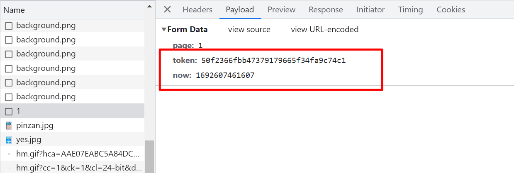
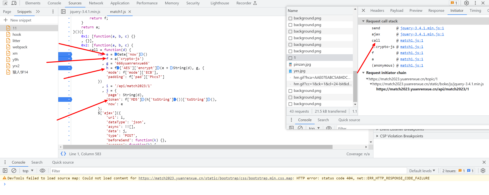

## 第一题

定位加密参数，通过f12 抓包我们可以看见主要有两个参数，token和now  这个now 估计是个时间戳，主要加密应该就是token了。通过initiator 或者全局搜索token 都可以，定位到生成请求的位置。可以看到now就是e 一个时间戳，token通过f和h生成，主要是对时间戳e 进行的AES和MD5加密。





先把这部分扣下来写成构造函数，然后再开始扣算法

```js
function get_params(d) {
    var e = Date['now']()
        , f = a('crypto-js')
        , g = '666yuanrenxue66'
        , h = f['AES']['encrypt'](e + String(d), g, {
        'mode': f['mode']['ECB'],
        'padding': f['pad']['Pkcs7']
    })
    return {
        'page': String(d),
        'token': f['MD5'](h['toString']())['toString'](),
        'now': e
    }
}
console.log(get_params(1))
```

