## 第二题

debugger右键过掉就好

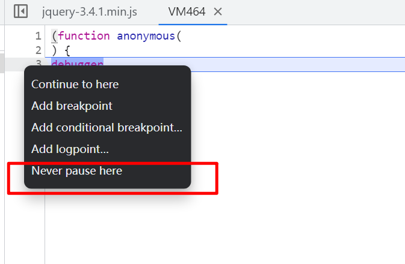

### 分析页面和加密参数

通过f12 抓包可以看见，每一次我们翻页，都会先请求一个png链接，但是看不见内容，肯定有猫腻，我们可以通过抓包工具fiddler或者复制请求用python  request请求查看内容，响应体式一串数字，应该是时间戳，初步估计是通过服务器时间戳进行加密生成下面的token。

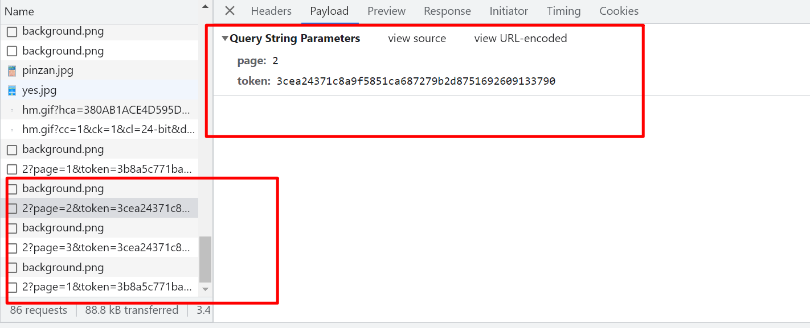

因为参数不好跟，我跟了好久没找到就直接hook了，因为他这个token是拼接在url后面的，所以hook  url第一次出现token的位置。

```js
(function () {
    var open = window.XMLHttpRequest.prototype.open;
    window.XMLHttpRequest.prototype.open = function (method, url, async) {
        if (url.indexOf("token") != -1) {
            debugger;
        }
        return open.apply(this, arguments);
    };
})();
```

hook到之后直接进堆栈

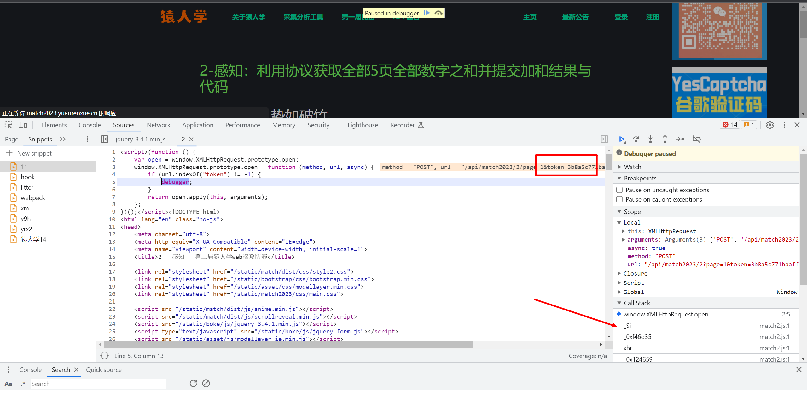

跟值，可以看到，token在_0x291432 这个值里，而且是已经拼接好的，通过argument赋值得来，而argument我们并不好找，我们看看上面有没有直接生成token值的地方，往上一点我们可以看见有一个值，和token一模一样的，就是这个`_0x1419b1`，其实我们再仔细一点观察就会发现` _0x1419b1 = _0x380df6['qiUgL'](_$o, _0x8c4029)`，其实这个值比token少一小段，这个后面再说。

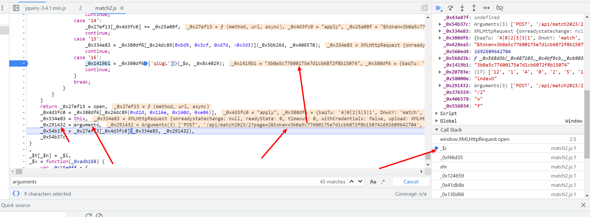

简化一下代码，通过控制台打印，我们可以知道 `_0x380df6['qiUgL']` 这个函数`ƒ (_0x315a52,_0x5c899f){return _0x315a52(_0x5c899f);}`接受两个参数，第一个作为函数第二个作为参数，所以我们直接简化代码然后再扣下来`token = _$o(_0x8c4029)`，然后再把参数和函数都打印出来看一下，我们可以看到，其实这个参数就是时间戳加上一个请求链接，那么开始扣加密函数，然后这个参数我们暂时给他写死。

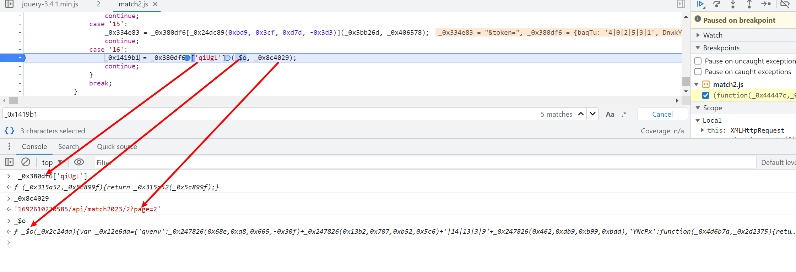

然后本着缺啥扣啥的原则，大概扣了四五个函数后就报下面这个错了，这个可能是里面存在格式检测，需要压缩一下，在线压缩工具https://c.runoob.com/front-end/51/

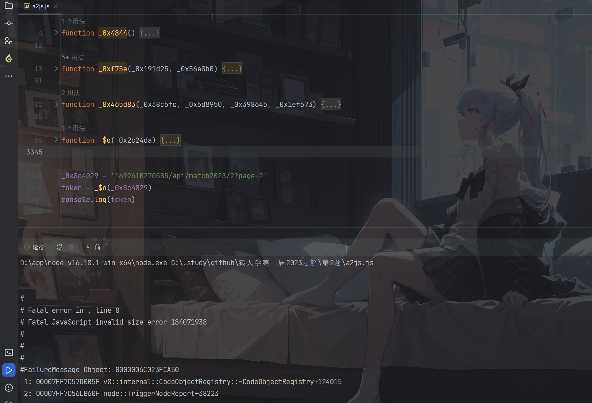

压缩后开始报错如下，其实压缩后是不太方便看，所以也可以准备两个文件，一个是格式化的，一个是压缩的，也可以通过行号啥的定位到报错位置，这里报错不是函数，这里是我们扣东西扣少了，这里用到了大数组，但是开头还有一个自执行函数，里面传参用到包含大数组的函数，把大数组进行重组了，所以我们还是把他扣下来。

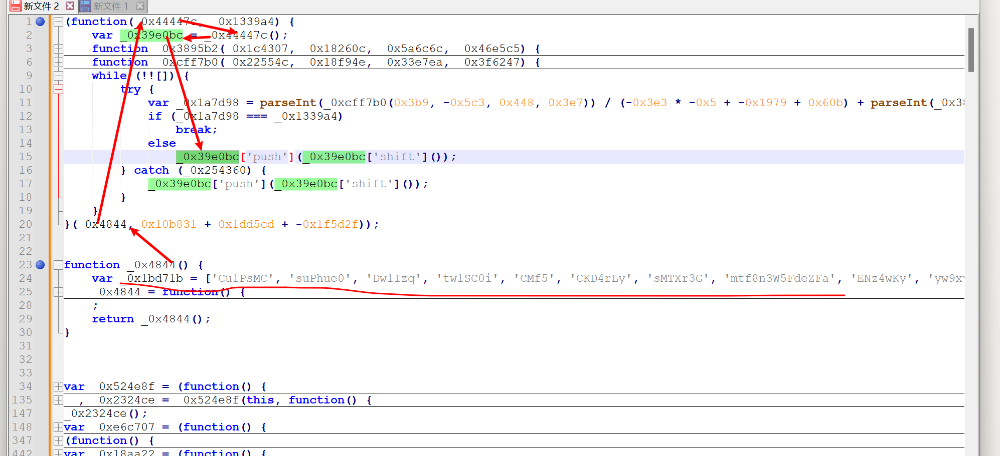

然后我们就可以看到出结果了但是和浏览器的结果不一样，说明里面可能会有环境检测，所以我们搜一下window之类的的关键字，window  document  global 等。然后就可以发现有typeof  window这样的字眼，我们可以到浏览器输出一下  这个在浏览器是object，而在我们本地是

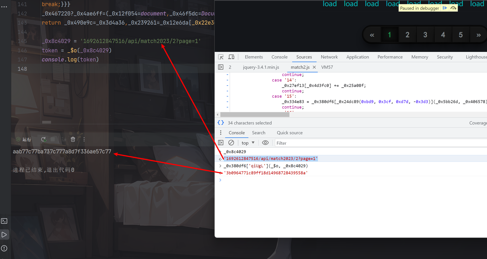

我们可以看`_0x490e9c = typeof login`这个login在我们本地是未定义，在浏览器是一个Boolean类型，所以下面就要开始补环境了。

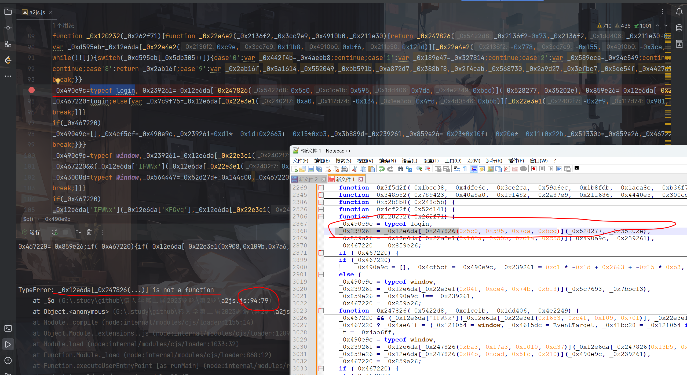

同理的里面还有typeof  (  window   document   Window   Document ) 这四个参数，js是大小写敏感的，所以每一个都不一样，都要补。

```js
window = global; 
Window = function (){}; 
document = {}; 
Document = {}; 
login = true;
```

然后运行报的`TypeError: Right-hand side of 'instanceof' is not callable`这个错，其实也是一个环境检测，报错在 `_0x41bc28=_0x12f054 instanceof _0x46f5dc` 这个位置，我们到网站打断点看一下，这里拿到的就是一个true我们直接给他写死看一下

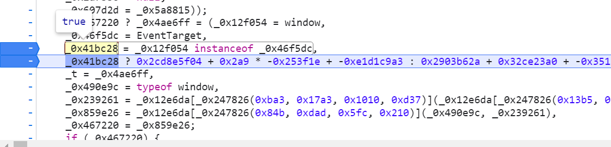

有结果了，但是值还是不一样，所以后面基本上都是一些环境监测和代码坑了，所以我就不一一截图主要就是，一般正常查找就先搜一下有没有异常捕获啥的，在try语句上打断点，然后看浏览器那边走的哪，然后修改一下。

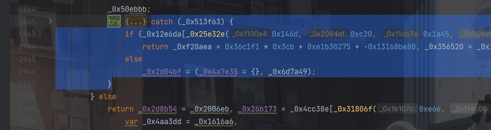

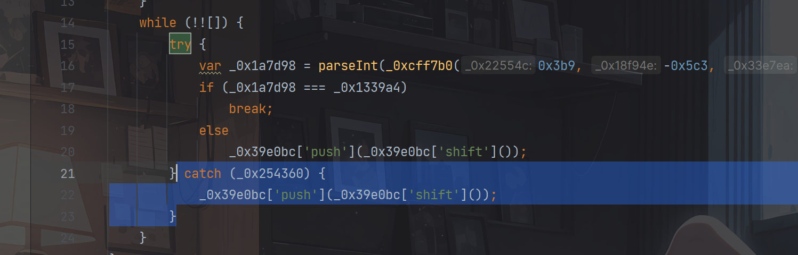

`TypeError: _0x54be74[_0x497406] is not a function`  在浏览器打断点可以看到，其实就是创建了一个canvas元素，最后使得_0x2089ab这个值为true，其实我们搜一下这几个变量使用的位置就可以发现，基本上都是5次左右使用，而且第一次是上面进行定义，其余的都在次进行调用，所以我们删掉也没有关系，对代码进行改写一下。

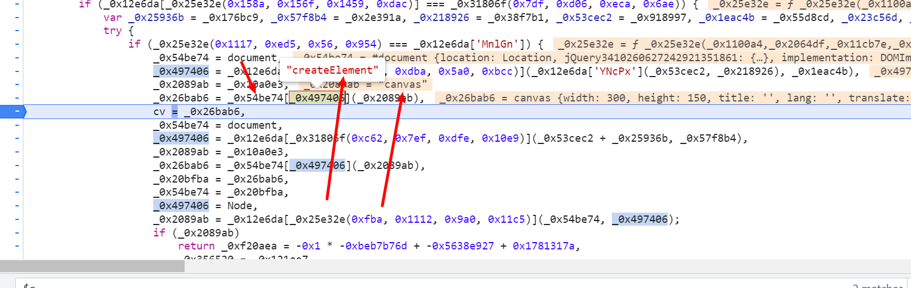

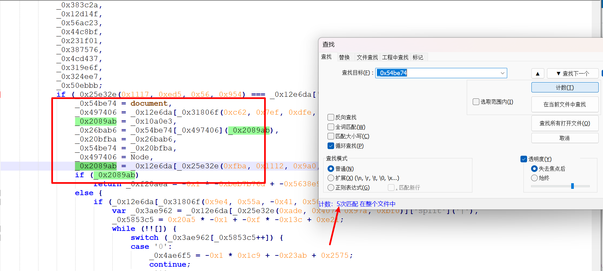

最后值得注意的还有这种三元表达式，其实生成的是一个定值，我们可以看一下后面是不是有一个定值然后给他改写成写死就行了

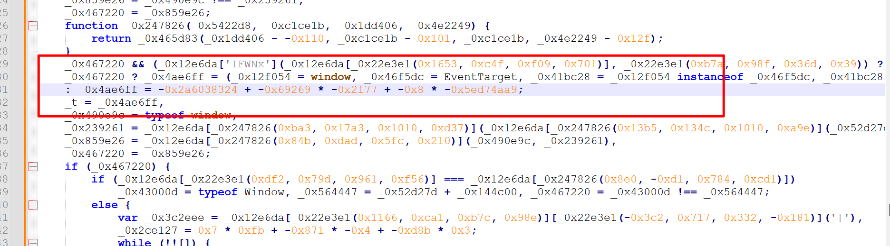

倒刺也差不多了，然后最后就是观察出最终逻辑，首先请求png 链接获取时间戳 t  把t  拼接上请求链接的后半部分进行加密，最后加密结果在拼上t  最终就是token了，关键代码：

```python
session = requests.session()
session.headers = headers
session.cookies.update(cookies)

with open('a2js.js', 'r', encoding='utf-8') as f:
    js_code = f.read()
ctx = execjs.compile(js_code)

s = 0
for page in range(1, 6):
    session.get('https://match2023.yuanrenxue.cn/api/loginInfo')
    response = session.get('https://match2023.yuanrenxue.cn/api/background.png')
    token = ctx.call('get_token', response.text, page)
    print(response, response.text, token)
    params = {
        'page': page,
        'token': token,
    }
    response = session.post('https://match2023.yuanrenxue.cn/api/match2023/2', params=params)
    print(response, response.text)
    s += sum(x['value'] for x in response.json()['data'])

print(s)

```
js核心代码，写一个请求函数，传入时间和页面，返回token
```js
function get_token(time, page) {
    var _0x8c4029 = time + '/api/match2023/2?page=' + page
    return _$o(_0x8c4029) + time
}

token = get_token(1692672732164, 2)
console.log(token, token === '3b8a54771c4a8c5850ca9032788adf351692672732164')
```